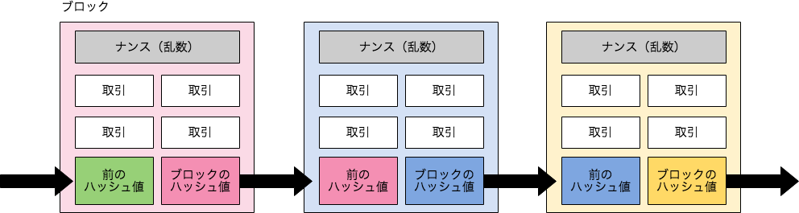

# MySQL8.0を使ってブロックチェーンを実装する

subtitle
:   第9回 関西DB勉強会

author
:   @masayuki14

theme
:   clear-blue


# 目次

- 自己紹介
- 概要
- 技術要素の解説
- デモ
- MySQL8.0の新機能


# 自己紹介

- もりさきまさゆき

- @masayuki14

{:width='360'}


{:.center}
**Follow me !!**


# 自己紹介

- 主夫
    - 妻1人 {::note} (フルタイム) {:/note} 幼児2人
    - フリーランス {::note} (Web系パートタイム) {:/note}

- コミュニティ
    - はんなりPython {::note} (第3金曜開催@京都) {:/note}
    - OSS Gate {::note} (11/24 ワークショップ@大阪) {:/note}


- スプーキーズアンバサダー

# スプーキーズ

- Web系システム
- ソーシャルゲーム　
- 中規模DB運用
    - MySQL, PerconaServer, MariaDB

{:.center}
**Webエンジニア積極採用中！！**

## プロパティ

background-image
:   spookies_logo.png

background-image-relative-width
:   50

background-image-align
:   right

background-image-relative-margin-right
:   3

{::comment}
{:/comment}

# スプーキーズ

勉強会を開催しています

- [テクテクテック#6](https://spookies.connpass.com/event/88611/) 
    - 11/13 (Thu)
    - テーマ

## プロパティ

background-image
:   spookies_logo.png

background-image-relative-width
:   50

background-image-align
:   right

background-image-relative-margin-right
:   3

{::comment}
{:/comment}

# 概要

> MySQL8.0を使って
> 簡略化したブロックチェーンを
> 実装した

# 概要

{::tag name="large"} やったこと {:/tag}

- ブロックチェーンをテーブルで表現
- MySQL Shell スクリプト実装
    - ブロック追加などのデータ操作
    - マイニング処理


# 技術要素の解説

{::tag name="large"} 使っているもの {:/tag}

- MySQL8.0
- MySQL Shell
- JavaScript

# 技術要素の解説

MySQL8.0
:   - ブロックのモデルをテーブルで表現
    - 取引データはJSON
    - Hash値はMD5で計算

# 技術要素の解説

MySQL Shell

:   - MySQLのCLIクライアント
    - DBアクセスのインタフェース
    - JavascriptでDBを操作が可能

# 技術要素の解説

Javascript

:   - テーブル操作
    - マイニング処理
    - MySQL Shellで実行


# ブロックチェーン

- 分散型ネットワーク
- 合意形成
- スマートコントラクト

{:.center}
**データ構造だけにフォーカス！**

# ブロックチェーン

構成要素

:   - ナンス(乱数)
    - 取引(トランザクション)
    - 前のブロックのHash値


# ブロックチェーン

ブロックチェーンの基本的な構造

{:relative-width='100'}


# マイニングとは

- ブロックのHash値に制約
- 制約を満たすナンス(乱数)を探すこと

# マイニングとは

**Hash値の先頭に0を10個連続させる！**

```
value = hash( nonce, transaction, prev_hash )

# => 00000000004b2a76b9719d911017c592
# md5 32桁
```

*nonce* を探せ！


# 実行環境

MySQLでブロックチェーンを表現

:   - ブロック -> Record
    - ブロックチェーン -> Table
    - Hash関数 -> MD5
    - Hash制約 -> 先頭に0が4つ連続

# 実行環境

```
CREATE TABLE `block` (
  `id` int(11) NOT NULL AUTO_INCREMENT,
  `transaction` json DEFAULT NULL,
  `nonce` int(11) DEFAULT NULL,
  `prev_hash` varchar(32) DEFAULT NULL,
  `hash` varchar(32) DEFAULT NULL,
  PRIMARY KEY (`id`)
) ENGINE=InnoDB
```
{: lang="sql" }


# 実行環境

例えばこんな Transaction

```
[
  {"name": "miyake", "date": "2018-04-01",
     "report": "今日は良い天気でした。"},
  {"name": "kataoka", "date": "2018-04-01",
     "report": "チョコレートが美味しかった。"},
  {"name": "tamamura", "date": "2018-04-01",
     "report": "電車が遅れて最悪だった。"}
]
```
{: lang="json" }


# デモ

```
$ mysqlsh -u root -p
```
{: lang="console" }


# デモ

```
// テーブル取得
table = session
  .getSchema('blockchain')
  .getTable('block')

// ヘルプが表示される
table.help()
// まだデータがないのでEmpty
table.select()

// オブジェクトでInsertできる
table.insert({
  transaction: [{'name': 'morisaki'}],
  prev_hash: ''}
)

```
{: lang="javascript" }


# デモ

```
// INSERTしたデータが参照できる
table.select()

// where句の指定など
record = table.select()
  .where('id = :id')
  .bind('id', 1)
  .execute().fetchOne()

```
{: lang="javascript" }


# デモ

```
// SQLモードに切り替え
\sql

use blockchain;
select * From block;
show create table block;
```
{: lang="sql" }


# マイニング処理

```
mining = function (id) {

  schema = session.getSchema('blockchain')
  table = schema.getTable('block')
  record = table.select().where('id = :id')
    .bind('id', id).execute().fetchOne()

  nonce = 0
  while (true) {
    nonce++
    hash = md5(record.transaction + nonce + record.prev_hash)
    // 条件に一致するHash値になれば終了
    if (hash.match(/^0000/)) {
      table.update()
        .set('hash', hash).set('nonce', nonce)
        .where('id = :id').bind('id', record.id)
        .execute()
      break
    }
  }
}
```
{: lang="javascript" }


# デモ


```
mining(1)

table.select()
record = table.select().where('id = 1')
  .execute().fetchOne()
record.hash
record.getField('nonce')

JSON.parse(record.transaction)
```
{: lang="javascript" }


# デモ


```
id2hash = function (id) {
  schema = session.getSchema('blockchain')
  table = schema.getTable('block')
  record = table.select()
    .where('id = :id').bind('id', id)
    .execute().fetchOne()
  return record.hash
}

format = function(prevId, transaction) {
  return {
    prev_hash: id2hash(prevId),
    transaction: transaction
  }
}
```
{: lang="javascript" }


# デモ


```
// id => hash 指定IDのHash値を返す
id2hash(1)
format(1, [{"name":"mysql"}, {"name":"masayuki", "date":"2018-10-14"}])

table.insert(format(1, [{"name":"yoshida", "date":"2018-10-15"}]))
mining(2)
table.insert(format(2, [{"name":"tanaka", "date":"2018-10-16"}]))
mining(3)
table.insert(format(3, [{"name":"okamura", "date":"2018-10-17"}]))
mining(4)
```
{: lang="javascript" }


# デモ


```
```
{: lang="javascript" }


# 実行環境

```
shell.connect('mysqlx://root@localhost')
schema = session.getSchema('blockchain')
table = schema.getTable('block')

target_id = 1
record = table.select().
  where('id = :id').bind('id', target_id).
  execute().fetchOne()

nonce = 0
while (true) {
  nonce++
  hash = md5(record.transaction + nonce + record.prev_hash)

  // 条件に一致するHash値になれば終了
  if (hash.match(/^0000/)) {
    table.update().
      set('hash', hash).
      set('nonce', nonce).
      where('id = :id').bind('id', record.id).
      execute()
    break
  }
}
```
{: lang="js" }


# 実行環境


```
$ time mysqlsh -f mining.js
Please provide the password for 'mysqlx://root@localhost': ****

    15326,
    "0000f14b8733a412a00a17abc1b7d3e7"

0.71user 0.03system 0:03.06elapsed 24%CPU (0avgtext+0avgdata 26956maxresident)k
240inputs+0outputs (0major+4062minor)pagefaults 0swaps
```

# 実行環境

制約を変えてハッシュを再計算する

```
$ time mysqlsh -f remining.js
Please provide the password for 'mysqlx://root@localhost': ****
{
    "hash": "00073e18bd64f8ca6a962cb960b65f77",
    "id": 1,
    "nonce": 1235
}
{
    "hash": "000223efef2ccb12da07574967292841",
    "id": 2,
    "nonce": 704
}
{
    "hash": "00058c18fc3f5e38ba0319ce27525a22",
    "id": 3,
    "nonce": 369
}
{
    "hash": "00000015c2b4d2395443e5eb94245794",
    "id": 4,
    "nonce": 1931
}
0.41user 0.02system 0:02.31elapsed 19%CPU (0avgtext+0avgdata 27624maxresident)k
0inputs+0outputs (0major+4162minor)pagefaults 0swaps

```

# 実行環境

先頭の0を増やすほど時間がかかる。

*デモ！！*


# おまけ

transaction を見やすくする *JSON_TABLE()*

```
select id, trans.*
from block, JSON_TABLE(
  `transaction`,
  '$[*]'
  columns (
    name varchar(32) path '$.name',
    `date` date path '$.date',
    report varchar(128) path '$.report'
  )
) trans;
```
{: lang="sql" }


# おまけ

```
+----+----------+------------+-----------------------------------------------------------------------------+
| id | name     | date       | report                                                                      |
+----+----------+------------+-----------------------------------------------------------------------------+
|  1 | miyake   | 2018-04-01 | 今日は良い天気でした。                                                      |
|  1 | kataoka  | 2018-04-01 | チョコレートが美味しかった。                                                |
|  1 | tamamura | 2018-04-01 | 電車が遅れて最悪だった。                                                    |
|  2 | miyake   | 2018-04-02 | 夕立がありすごい雨でした。                                                  |
|  2 | kataoka  | 2018-04-02 | ドーナツならチョコレートがかかっていて欲しい。                              |
|  2 | tamamura | 2018-04-02 | 前を歩くおじさんの傘が刺さりそうで腹がたった。                              |
|  3 | miyake   | 2018-04-03 | 月が綺麗ですね。                                                            |
|  3 | kataoka  | 2018-04-03 | 紅茶ならダージリンが好みだ。チョコレートを添えて。                          |
|  3 | tamamura | 2018-04-03 | 女子高生が歩道に広がって邪魔だった。                                        |
|  3 | kawai    | 2018-04-03 | ストレッチをしたら気持ちよく寝れました。                                    |
|  4 | miyake   | 2018-04-04 | セミが鳴いていたので夏を見つけた気分です。                                  |
|  4 | kataoka  | 2018-04-04 | シフォンケーキにはチョコクリームがとても合う。                              |
|  4 | tamamura | 2018-04-04 | 電車の中でハンバーガー食うなよ。臭うだろ。                                  |
|  4 | kawai    | 2018-04-04 | はじめてランニングハイを感じられました。                                    |
+----+----------+------------+-----------------------------------------------------------------------------+
```

# おまけ

再帰アクセスする *CTE*

```
with recursive
blockchain (id, hash, path)  as (
  select id, hash, cast(id as char(100))
  from block2
  where id = 1
union all
  select b.id, b.hash, concat(b.id, '->', bc.path)
  from blockchain bc join block2 b
  on bc.hash = b.prev_hash
)

select * from blockchain;
```

# おまけ

```
+------+----------------------------------+------------+
| id   | hash                             | path       |
+------+----------------------------------+------------+
|    1 | 00073e18bd64f8ca6a962cb960b65f77 | 1          |
|    2 | 000eec3e66368ca655715136995d1701 | 2->1       |
|    3 | 00058c18fc3f5e38ba0319ce27525a22 | 3->2->1    |
|    4 | 00000015c2b4d2395443e5eb94245794 | 4->3->2->1 |
+------+----------------------------------+------------+
```

# まとめ

- ブロックチェーン自体は簡単なモデル
- ナンスを探すのが大変
- MySQL8.0 イケてる！
